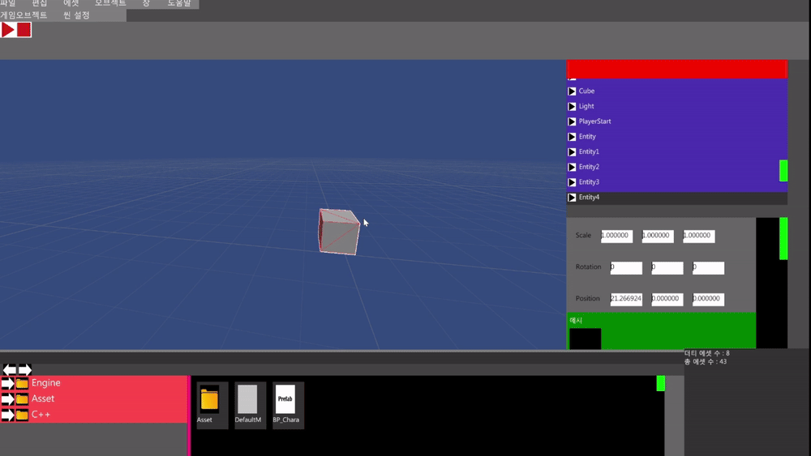
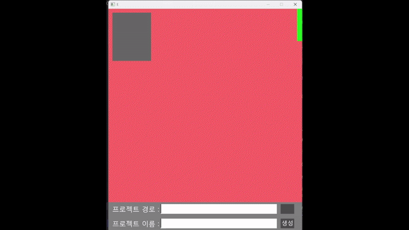
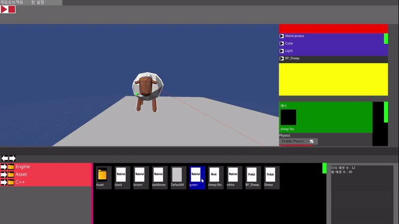
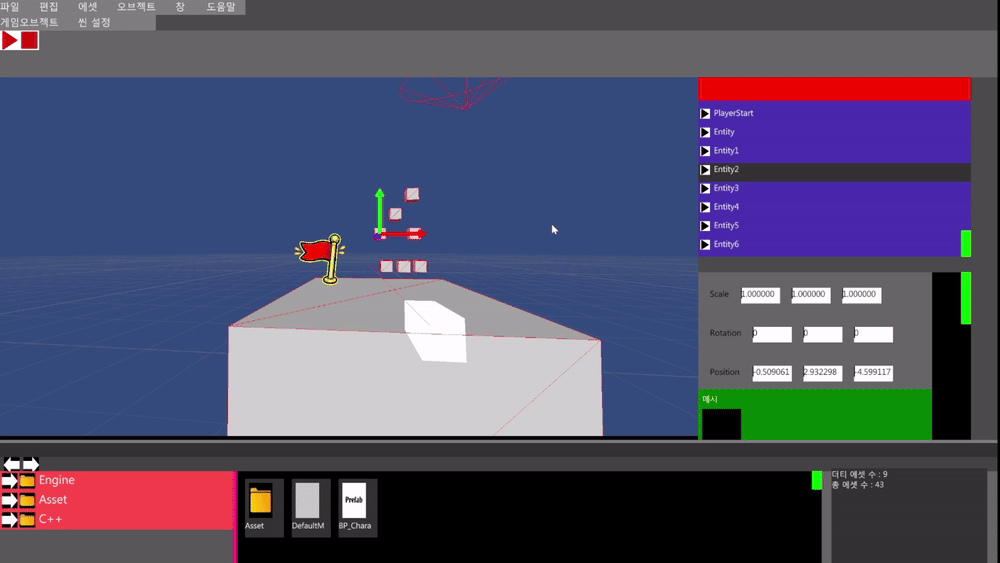
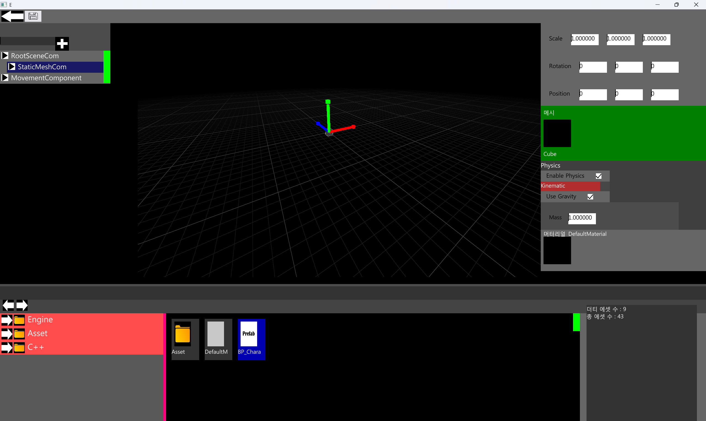

<h1 align="center"> GameEngine</h1>


<p align="center"><strong> C++20 / DirectX 12를 기반으로 개발 중인 에디터 중심 자체 게임 엔진</strong></p>


<p align="center">
    
    
    
    
  </p>


## 프리뷰

### Scene Editor 


<details>
<summary>더 많은 프리뷰 보기</summary>


### Project Select Scene



### Material Editor


### Physics Simulation



### Prefab Editor


</details>


## 주요 기능
| **기능** | 설명 |
|---|---|
| **DirectX 12 렌더링 파이프라인** | Render Pass Graph 기반으로 정적 메시, UI, 스카이 스피어, 빌보드, 디버그 라인, 외곽선 렌더링 |
| **통합 에디터 환경** | Scene Hierarchy, Property Inspector, Transform Gizmo, Selection Manager를 이용한 씬 편집 기능 |
| **런타임 리플렉션 시스템** | LLVM/Clang 기반 코드 생성기를 통해 클래스 생성, 프로퍼티 접근, 직렬화 및 Inspector 자동 생성 |
| **에셋 파이프라인** | Texture, Material, Static Mesh, Font 에셋의 저장·로드와 비동기 Resolve 및 GPU 업로드 |
| **FBX 정적 메시 임포트** | FBX 노드 병합, 트랜스폼 베이크, SubMesh 구성, 머티리얼·텍스처 의존성 처리 |
| **Scene/Map 저장 및 로드** | Object와 Component 계층, 게임 플레이 설정, 환경 설정을 포함한 맵 직렬화 |
| **Prefab 시스템** | Prefab 생성과 편집, Component 계층 구성, 인스턴스 생성 및 원본 변경사항 동기화 |
| **Material 편집 환경** | 머티리얼 프로퍼티 및 텍스처 슬롯 편집, Preview Scene을 통한 실시간 결과 확인 |
| **자체 UI 프레임워크** | Layout, Scroll, Dropdown, Search Select, Drag & Drop, 입력 Focus/Capture 및 Scissor Clipping |
| **기초 강체 물리 시스템** | Static·Dynamic·Kinematic Body, Box 충돌 감지, Contact Manifold, Impulse, 마찰, 관통 보정 및 Sleep 처리 |


## 개발 상태
>[!NOTE]
>  현재 개인 학습 및 엔진 구조 연구를 목적으로 개발 중입니다.
>
> - FBX 임포트는 현재 정적 메시를 중심으로 지원합니다.
> - 물리 시스템은 Box 강체 충돌을 중심으로 개발 중입니다.
> - 스키닝 메시와 애니메이션 시스템은 아직 지원하지 않습니다.


## 개발 환경 
- Windows 10/11
- Visual Studio 2022 또는 Ninja
- CMake 3.25 이상
- C++20 지원 컴파일러
- DirectX 12 
- vcpkg
- Autodesk FBX SDK 2020.3.9


## 실행을 위한 사전 작업

1. [Download Latest](https://github.com/akflfldh/GameEngine/releases/latest)에서 EngineDependencies.zip을 다운로드합니다.
2. 압축을 해제합니다.
3. 다음과 같이 배치합니다.
```text
GameEngine/
  ├─ ClangCodeGenerator.exe
  ├─ zstd.dll
  ├─ zlibd1.dll
  └─ QuadCallbackSystemDLL/
      ├─ QuadCallbackSystem.lib
      └─ QuadCallbackSystem.dll
```

4.  vcpkg 최상위 폴더경로를 환경변수 VCPKG_ROOT로 설정해야합니다.

5.  CMakeUserpresets.json파일 생성후 캐시변수 FBXSDK_ROOT를 fbxsdk include와 ,lib가 존재하는 폴더경로로 설정해야합니다.(CMakeUserpresets.json.example예시 파일이 존재)

## 빌드 명령
```powershell
cmake --preset user-debug-ninja(직접 지정한 name)
cmake --build --preset user-debug-ninja
```